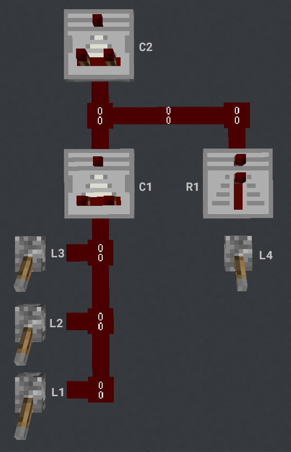
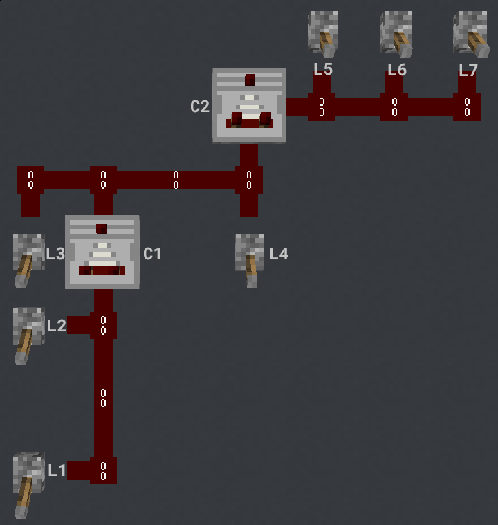
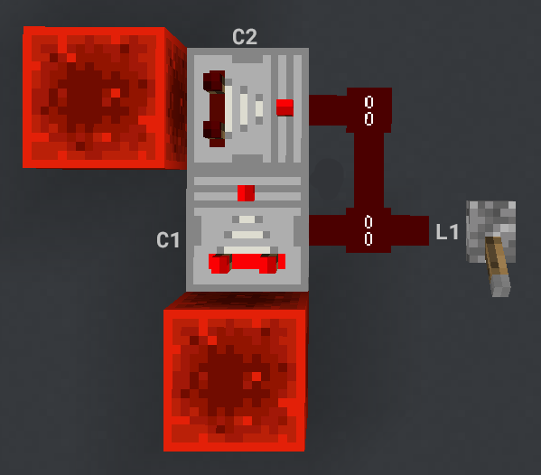

Below is a list of optimizations in order of how they should be executed

- Discrete Comparators
- IO Coelessance
- Synced Circuit Analysis*
    - Advanced Link Pruning
    - Multi-Node LUTs 
    - Synced IO Offloading
    - LUT Load Balancing
- Timing / Clock Analysis*
    - Register Pruning
- Motif Generator*
- Behavioral Analysis*
    - Circuit Optimization

*These dont update the graph, instead they provide information about the graph that is used in later optimizations.

Terminology

Signal Strength (SS)  - A value from 0-15 that Minecraft uses to describe the internal state of a comparator
State                 - A value from 0-N that the FPGA uses to describe the internal state of a comparator
Discrete Node         - (Lever, Button, Pressure Plate, Repeater, Torch)
Discrete Input        - An edge connecting from a `Discrete Node` to a Comparator
Analog Input          - An edge connecting from a Comparator to a Comparator
Look Up Table (LUT)   - A table of Inputs and what to Output for each Input
OneHot                - Representing a number where only 1 bit can be ON at a time and the max number is N-1
Unary                 - Representing a number where the number of bits that are ON represents the number the max number is N-1
Binary                - Representing a number where each number gets its own combination of 1s and 0s and the max number is (N^2)-1

Optimizing Comparator Behaivor

Determine all possible comparator states

Subraction Mode
Start with highest side input. Mask any influence that input has on the back input from every input with back connection. Loop through every input with a back connection and add possible results to 

Representing SS on the FPGA -
reworking the way comparators store and calculate their internal state so that they operate with the bare minimum amount of logic is not only important for decreasing their Logic Element usage but will also increase the maximum clock speed of the overall system.

Comparators on the FPGA store their internal state as a N bit register. Where N is the number of possible states (including 0) that comparator can be in. N is limited to 15 possible states. The current state of a comparator is determined by the most significant active bit in this register. All other bits less significant that this bit can be in any state. Storing values in this way makes it much easier to determine what the input states of a comparator are.

Normally to compute the output SS of a comparator you calculate the max input SS from the back and side and then perform the approprate comparison / subtraction to get the output SS. However becsaue of the way the FPGA stores SS calculating the max input is as easy as ORing the inputs that corespond to the same input SS.

Once The inputs have been calulated they go through a generated LUT that describes how each input coresponds to a given output state

Take the following circuits for example

C1 has 3 possible states so it will internally have a 3 bit register. Because the state of the comparator only depends on the most significant active bit the input state of C1 is simply [L1, L2, L3] and becasue there are no side inputs [L1, L2, L3] also describes the internal state of C1. C2 is slightly more complicated as we now have an analog and a discrete input. In this case there are still only 3 possible input states but one of these states has 2 possible sources so the input state of C2 is [C1[0] | R1, C1[1], C1[2]] and becasue there are no side inputs this is also the internal state of C2.

This time C1 only has 2 possible states but keep in mind that these states arent sequential in SS and represent the values of 13 and 15. C2 has a back and side input. Back = [C1[0], L3, C1[1], L4], Side = [L7, L6, L5]. Now to actually compute the internal state of C2. There are 4 possible internal states of C2 [B[0] & !(S[0] | S[1] | S[2]), B[1] & !(S[1] | S[2]), B[2] & ! S[2], B[3]] where B is the back input and S is the side input. It just so happens that in compare mode the internal state will always only have 1 bit active.

What about comparator Loops?
Comparator loops dont play nicely with this system becasue it requires knowing what the possibe states of each input are. In this case of a comparator loop this information is impossible to know without doing further analysis. so what do we do?

take this very simple comparator loop. When the lever is activated the system goes to SS 15 and then counts down by 1 to 0 after the lever is deactivated 

For loops like this until more analysis is done it must be assumed that all comparators can be in any state 1-15. It doesnt really matter which comparator we start with but lets start with C2. C2 has a constant back input state and 15 side input states [C1[0] ... C1[14]]. the internal state is [C1[14] ... C1[]] 

Representing Comparator States
- Binary
- Unary
- 1 Hot

Calculating input SS
In situations where we have multiple `Inputs` we need to find the highest `SS` value

Binary

OneHot - computing the max of n OneHot numbers depends on 2 things  you have to check each bit. A bit is the max if it is ON and every bit above it is OFF. If 2 or more inputs correspond the the same CS value they must be OR'd together before preforming this operation.

genvar i;
generate 
    for (i = states-1; i >= 0; i = i - 1) begin 
        if (i == states-1) begin
            assign output[i] = input[i];
        end
        else begin
            assign output[i] = ~(|input[states-1:i+1]) & input[i];
        end
    end
endgenerate

Unary - Computing the max of n Unary numbers depends on 2 things. The number of `inputs` and the number of `input` `states`. for I `inputs` and N `input` `states` 

Comparator Modes
- Compare
Unary is the best representation for Compare mode
- Subtract

